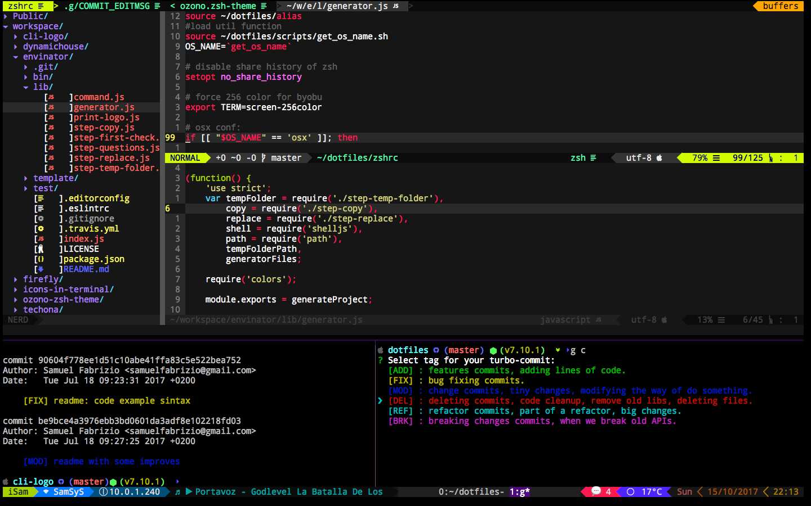
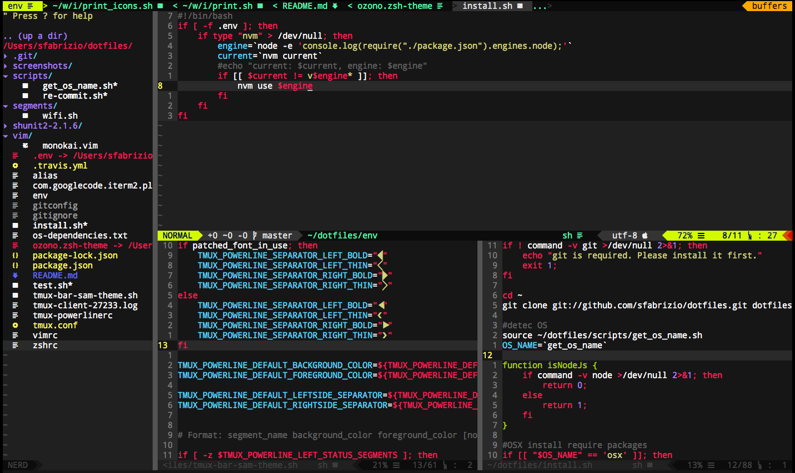
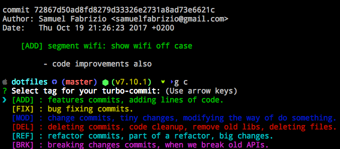
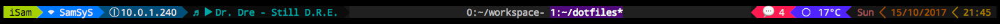
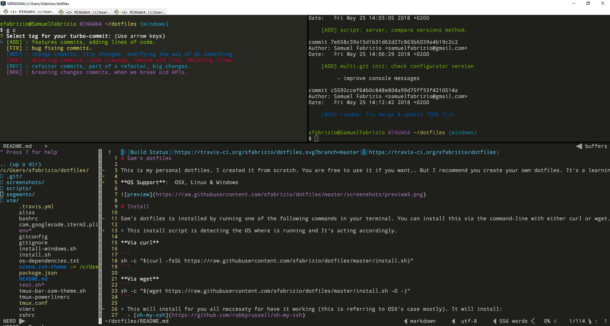

[](https://travis-ci.org/sfabrizio/dotfiles)
# Sam’s dotfiles

This is my personal dotfiles. I created it from scratch. You are free to use it if you want.. But I recommend you create your own dotfiles. It's a learning journey and It's sastifying build your own tools (at least for me). Feel free to take this dotfiles as base/inpiration.

**OS Support**:  OSX, Linux & Windows



# Install

Sam's dotfiles is installed by running one of the following commands in your terminal. You can install this via the command-line with either curl or wget.

> This install script is detecting the OS where is running and It's acting accordingly.

**Via curl**

```
sh -c "$(curl -fsSL https://raw.githubusercontent.com/sfabrizio/dotfiles/master/install.sh)"
```

**Via wget**
```
sh -c "$(wget https://raw.githubusercontent.com/sfabrizio/dotfiles/master/install.sh -O -)"
```

> This will install for you all neccesaty for have it working (this is referring to OSX's case mostly). It will install:
  - [oh-my-zsh](https://github.com/robbyrussell/oh-my-zsh)
  - [Brew](https://brew.sh/)  (OSX package manager)
  - [byobu](http://byobu.co/)
  - [turbo-git](https://github.com/labs-js/turbo-git)
  - [nodeJs](https://nodejs.org/en/)
  - [NVM](https://github.com/creationix/nvm)
  - [autoenv](https://github.com/kennethreitz/autoenv)
  - [tmux-powerline](https://github.com/erikw/tmux-powerline)
  - and It will copy all the dotfiles for this tools. Creating also a backup of your previus dotfiles.


# Features

## OH-MY-ZSH
- custom zsh theme: [ozono](https://github.com/sfabrizio/ozono-zsh-theme)
- [ozono](https://github.com/sfabrizio/ozono-zsh-theme): switch the icon according OS: linux, mac, rasbian, etc.
- [ozono](https://github.com/sfabrizio/ozono-zsh-theme): show node js version only on js projects.
- auto switch node js version enviroment only when it’s necessary. Using Autoenv


## VIM

This configuration work with the regular vim but I'm usin nvim instead.

- code higliting: js, jsx, html,css, scss, bash, c, etc. linting.
- auto ident js code.
- nerd tree, vim icons, etc.
- eslint_d for faster linting.



## Git

- turbo-git
- custom shorts alias & turbo git alias
- colors improvements
- global gitconfig & global gitignore



## TMUX

- easy shorcuts thanks to byobu
- beter colors, match with ozono theme
- custom tmux powerline bar




# Windows Support

After many tries of find a propper terminal under Windows. I decided to use `bash` instead of `zsh`.
I was able to install the linux version of this dotfiles in [ubuntu-for-windows](https://docs.microsoft.com/en-us/windows/wsl/install-win10). but the performance is not good and it has weird behaviours. I also tried out [Hyper](https://hyper.is/) and others. And After 1 year of this tries..

My Conclution: [git-bash](https://gitforwindows.org/) terminal with linux extended commands and being used with [ConEmu](https://conemu.github.io/en/Downloads.html) It's the best!

## Diffs running over windows:

- Use bash intead zsh.
- No tmux, instead use `ConEmu` Spliting Features
- install script: It's the same install entry as in linux but It's doing a fallback to `intall-windows.sh`
- Use vim instead of Nvim
- Include alias only valid for windows.
- vim: disable monokai theme, this cause issues on the colors.
- git: disable diff-so-fancy, It's not sopported on windows.




## TODO:
- ~~install script: install autoenv~~
- ~~install script: should install oh-my-zsh~~
- ~~one command for install all the dependencies OSX~~
- ~~tmux-bar: create custom segments.~~
- ~~tmux-bar: show spotify playing song and change it from the bar.~~
- ~~install nvim on script install~~
- ~~windows support - find alternatives, a propper terminal~~
- vim: disable monokai theme only on windows.
- git: disable diff-to-fancy only on windows.
- install: add patched font, this is currently manual work.
- auto updates on dotfiles
- write unit tests
- vim: create plugin for auto fix eslint warnning.
- implement autoenv global file
- autocheck new node js version on new session start
- autocheck updates of nvim.

<p align="center">
  <a href="https://github.com/labs-js/turbo-git/blob/develop/README.md"></a>
</p>
