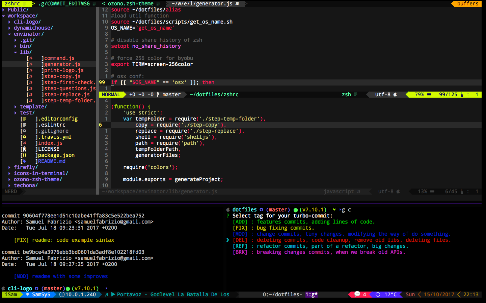
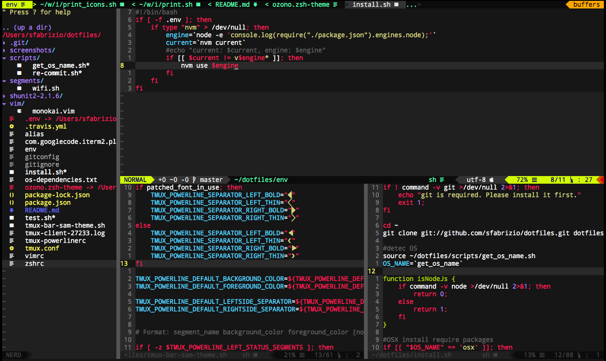
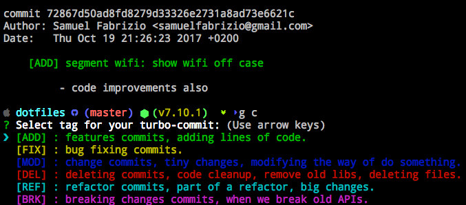
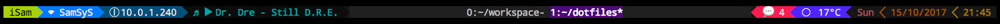
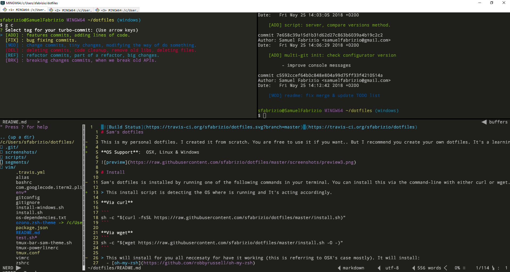

[](https://github.com/sfabrizio/dotfiles/actions/workflows/test.yml)
[](https://github.com/sfabrizio/dotfiles/actions/workflows/install-linux.yml)
[](https://github.com/sfabrizio/dotfiles/actions/workflows/install-macos.yml)
[](https://github.com/sfabrizio/dotfiles/actions/workflows/install-windows.yml)
# Sam’s dotfiles

This is my personal dotfiles. I created it from scratch. You are free to use it if you want.. But I recommend you create your own dotfiles. It's a learning journey and It's sastifying build your own tools (at least it is for me). Feel free to take this dotfiles as base or inspiration.

**OS Support**:  OSX, Linux & Windows



# Install

Sam's dotfiles is installed by running one of the following commands in your terminal. You can install this via the command-line with either curl or wget.

> This install script is detecting the OS where is running and It's acting accordingly.

**Via curl**

```
sh -c "$(curl -fsSL https://raw.githubusercontent.com/sfabrizio/dotfiles/develop/install.sh)"
```

**Via wget**
```
sh -c "$(wget https://raw.githubusercontent.com/sfabrizio/dotfiles/develop/install.sh -O -)"
```

The script re-execs itself under bash when started with `sh`, is safe to re-run, and previews everything with:

```
DOTFILES_INSTALL_DRY_RUN=1 sh -c "$(curl -fsSL https://raw.githubusercontent.com/sfabrizio/dotfiles/develop/install.sh)"
```

> The one-liners track the `develop` branch (the branch this repo actually maintains).

This will install for you. all neccesaty pkg for have it working. The only real pre-requirement is have `git` command.

> The installer is idempotent (safe to re-run), works under plain `sh` (it re-execs itself with bash), backs up your existing configs before wiring, and reports failed steps in a final summary. Preview everything it would do with `DOTFILES_INSTALL_DRY_RUN=1 bash install.sh`.

## installation packages:
  - [brew](https://brew.sh/) (OSX only)
  - [oh-my-zsh](https://github.com/robbyrussell/oh-my-zsh)
  - [byobu](http://byobu.co/) (OSX/linux)
  - [nodeJs](https://nodejs.org/en/)
  - [turbo-git](https://github.com/labs-js/turbo-git)
  - [nvm](https://github.com/creationix/nvm)
  - [autoenv](https://github.com/kennethreitz/autoenv)
  - [tmux](https://en.wikipedia.org/wiki/Tmux)
  - [tmux-powerline](https://github.com/erikw/tmux-powerline)
  
 After package installations It will create references on home directory to these .dotfiles, Creating also a backup's copy of previous .dotfiles


# Features

## OH-MY-ZSH
- custom zsh theme: [ozono](https://github.com/sfabrizio/ozono-zsh-theme)
- [ozono](https://github.com/sfabrizio/ozono-zsh-theme): switch the icon according OS: linux, mac, rasbian, etc.
- [ozono](https://github.com/sfabrizio/ozono-zsh-theme): show node js version only on js projects.
- auto switch node js version enviroment only when it’s necessary. Using Autoenv


## Modern CLI tools

Wired in [tools.zsh](tools.zsh) (loaded by zshrc), installed via [os-dependencies.txt](os-dependencies.txt):

- [bat](https://github.com/sharkdp/bat): `cat` with syntax highlighting (`bat file.js`); `ca` = plain cat-like output, no line numbers/header
- [zoxide](https://github.com/ajeetdsouza/zoxide): smarter `cd` — `z proj` jumps to your most-used matching dir
- [fzf](https://github.com/junegunn/fzf): `Ctrl-R` fuzzy history search, `Ctrl-T` file insert with bat preview, `Alt-C` fuzzy cd
- [ripgrep](https://github.com/BurntSushi/ripgrep): fast `grep` alternative (`rg`)


## Auto updates

oh-my-zsh style: every ~13 days the first shell start checks for updates in the background (never blocks the prompt) and asks `Update now? [Y/n]`; after updating it prints what changed. Configured with env vars:

- `DOTFILES_UPDATE_MODE`: `prompt` (default) | `auto` (pull + show changes, no questions) | `reminder` (just notify) | `disabled`
- `DOTFILES_UPDATE_INTERVAL_DAYS`: check interval (default 13)
- `DOTFILES_DISABLE_AUTO_UPDATE=1`: turn it off
- update manually anytime with `dotfiles-update`

## Local overrides

Machine-specific tweaks live in per-host files that the configs source but git never touches (the installer creates them empty; reinstall never overwrites them):

- `~/.gitconfig.local` — extra/overriding git settings (included last, wins over the shared config)
- `~/.zshrc.local` / `~/.bash.local` — shell additions
- `~/.vimrc.local` / `~/.tmux.local` — editor and multiplexer additions
- `~/.tmux-powerline.local` — **extra bar segments**, appended after the theme's arrays:

  ```bash
  TMUX_POWERLINE_RIGHT_STATUS_SEGMENTS+=("uptime 235 136")   # append to the right bar
  TMUX_POWERLINE_LEFT_STATUS_SEGMENTS+=("disk_usage 12 233") # append to the left bar
  TMUX_POWERLINE_RIGHT_STATUS_SEGMENTS=("new 1 255" "${TMUX_POWERLINE_RIGHT_STATUS_SEGMENTS[@]}")  # prepend
  ```

  Segment scripts must exist in `~/dotfiles/segments/` or in the tmux-powerline stock segments (`uptime`, `disk_usage`, `load`, ...). `dotfiles-doctor` validates the file's syntax.

## Commands

`bin/` ships personal commands (on PATH via tools.zsh/bashrc):

- `dotfiles-update` — update the dotfiles now (same check as the background auto-update)
- `dotfiles-doctor` — health check: config wiring, tools, tmux bar render + click ranges, tmux-powerline pin drift, CI status
- `re-commit` / `multi-git` — git helpers

- update manually anytime with `dotfiles-update`

## Terminal font

The tmux bar separators and icons are Nerd Font glyphs and render with **your terminal's font** — a mismatched font shows them at the wrong size. This setup standardizes on **Hack Nerd Font Mono**: install it on every machine you connect from and select it in the terminal:

```
dotfiles-doctor        # tells you which nerd fonts are installed
nerd-font-download     # installs Hack (any ryanoasis/nerd-fonts font works: pass a name)
```

## VIM/NVIM

This configuration work with the regular vim but I'm usin nvim on Linux/OSX.

- code higliting: js, jsx, html,css, scss, bash, c, etc. linting.
- auto ident js code.
- nerd tree, vim icons, etc.
- eslint_d for faster linting.
- etc, etc. Check [vimrc](vimrc) file for more references.



## Git

- turbo-git
- custom shorts alias & turbo git alias
- colors improvements
- global gitconfig & global gitignore



## TMUX

- easy shorcuts thanks to byobu
- beter colors, match with ozono theme
- custom tmux powerline bar
- **clickable segments** (tmux >= 3.3): click `+` on the left bar to open a new window (byobu F2), click the stacked-rows icon to split horizontally (byobu Shift-F2); click the red cross on the right bar to arm a pane-close, then confirm `✓` or cancel `✗` (auto-cancels after 10s or when you switch pane/window)
- byobu integration: byobu launches with this tmux config (`byobu.tmux.conf`), keeping byobu F-key bindings and the powerline bar
- custom segments for the bar: cpu temperature (smctemp on macOS / lm-sensors on Linux), gpu temperature (nvidia-smi; auto-hidden on Apple Silicon where sensors are combined), weather (yr.no, no API key), battery, lan ip, now playing, close-pane with confirm
- macOS notification counter segments (slack/whatsapp/etc.) — OSX only, silently empty on Linux




# Windows Support

After many tries of find a propper terminal under Windows. I decided to use `bash` instead of `zsh`.
I was able to install the linux version of this dotfiles in [ubuntu-for-windows](https://docs.microsoft.com/en-us/windows/wsl/install-win10). but the performance is not good and it has weird behaviours. I also tried out [Hyper](https://hyper.is/) and others. And After 1 year of these tries..

My Conclution: [git-bash](https://gitforwindows.org/) terminal with linux extended commands and being used with [ConEmu](https://conemu.github.io/en/Downloads.html) It's the best!

## Diffs running over windows:

- Use bash intead zsh.
- No tmux, instead use `ConEmu` Spliting Features
- install script: It's the same install entry as in linux but It's doing a fallback to `intall-windows.sh`
- Use vim instead of Nvim
- Include alias only valid for windows.
- vim: disable monokai theme, this cause issues on the colors.
- git: disable diff-so-fancy, It's not sopported on windows.




## TODO:
- ~~install script: install autoenv~~
- ~~install script: should install oh-my-zsh~~
- ~~one command for install all the dependencies OSX~~
- ~~tmux-bar: create custom segments.~~
- ~~tmux-bar: show spotify playing song and change it from the bar.~~
- ~~install nvim on script install~~
- ~~windows support - find alternatives, a propper terminal~~
- ~~tmux-bar: clickable segments - open window/split and close pane with confirm/cancel~~
- ~~tmux-bar: byobu integration (byobu boots with this tmux config)~~
- ~~install: add patched font - wired into the installer (optional, auto-skipped non-interactive; `scripts/nerd-font-download.sh`)~~
- ~~write unit tests - `test.sh` is self-contained (syntax check, unit tests, installer dry-run)~~
- ~~add github actions workflow running test.sh - runs on every push, badge at the top of this readme~~
- ~~auto updates on dotfiles - omz-style background check (13d), prompt/reminder/auto modes, `dotfiles-update` command~~
- implement autoenv global file
- autocheck new node js version on new session start
- autocheck updates of nvim.

<p align="center">
  <a href="https://github.com/labs-js/turbo-git/blob/develop/README.md"></a>
</p>
